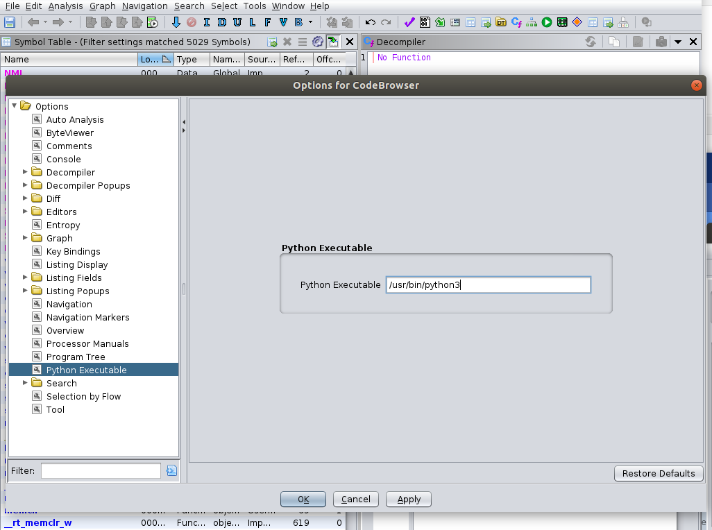
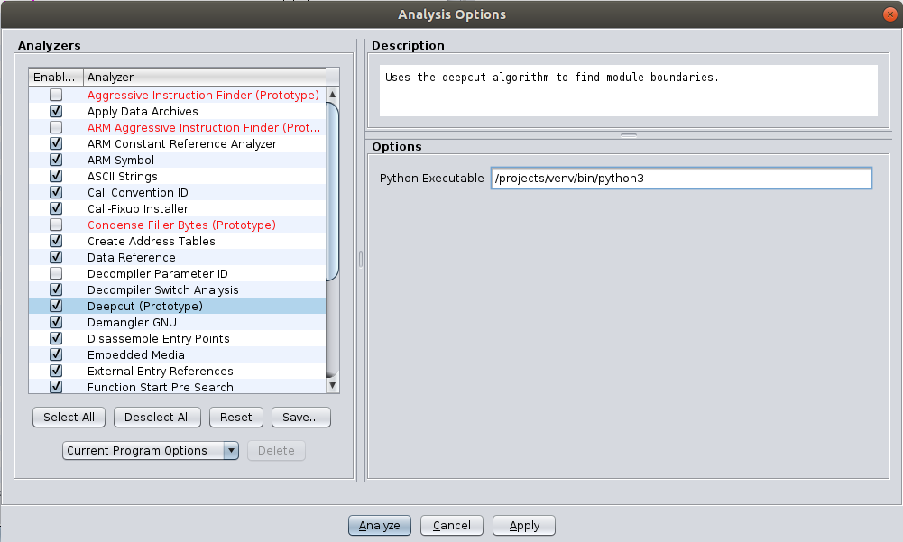
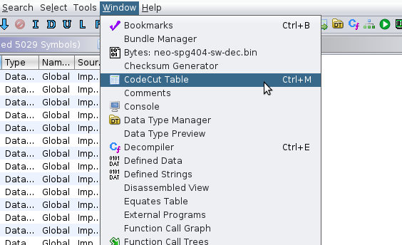

# CodeCut Plugin for Ghidra

Ghidra Plugin for DeepCut / CodeCut GUI

## Theory of Operation
CodeCut allows a user to assign functions to object files in Ghidra, and then interact with the binary at the object file level.  Functions are assigned to object files by setting the `Namespace` field in the Ghidra database.  DeepCut attempts to establish initial object file boundaries which the user can then adjust using the CodeCut Table window. 

## Plugin Installation
Follow normal Ghidra extension installation procedures.  Copy the CodeCut and DeepCut extension zip into `$GHIDRA_INSTALL_DIR/Extensions` then in the main Ghidra window selection **File -> Install Extensions** and select the CodeCut and DeepCut boxes.  Ghidra will tell you it needs to restart.  

**NOTE:** After restarting and loading a CodeBrowser window, Ghidra will tell you it has found new plugins and ask if you want to configure them.  Only CodeCut shows up in this window.  This is because DeepCut is a "one-shot" analyzer (it is still installed).

## Configuring Native Python Paths & Python Dependencies
Both CodeCut and DeepCut rely on native Python (outside of Ghidra) on your system.  CodeCut uses native Python for guessing module names.  DeepCut's model evaluation runs in native Python.  

### Native Python Dependencies
CodeCut: 
- nltk

DeepCut: 
- torch 1.7.1
- torch-geometric 1.6.3
- torch-cluster 1.5.8
- torch-sparse 0.6.8
- torch-scatter 2.0.5
- torch-spline-conv 1.2.0

To install dependencies run:

```
pip3 install nltk
pip3 install torch==1.7.1+cpu torch-geometric==1.6.3 torch-cluster==1.5.8 torch-spare==0.6.8 torch-scatter==2.0.5 torch-spline-conv==1.2.0
```

(assuming that pip3 points to the version of Python you plan to use below)

### Configuring CodeCut Python Path


Configure the native Python path for CodeCut by choosing **Edit -> Tool Options** and selecting "Python Executable."

### Configuring DeepCut Python Path


Configure the native Python path for DeepCut by choosing **Analysis -> Analyze All Open...** and selecting **Deepcut (Prototype)**.  After changing the path, click the **Apply** button.

## Running DeepCut Analysis
DeepCut is best run as a one-shot analyzer *after* initial auto-analysis.  Select **Analysis -> One Shot -> Deepcut**.  After DeepCut runs, you can view the results by looking at the **Namespace** field in the **Symbol Table** view.

## Using CodeCut


After DeepCut runs, you can interact at an object file level with the **CodeCut Table** view.  Select **Window -> CodeCut Table**  You can have CodeCut guess the module names (based on string references) by choosing **Analysis -> Guess Module Names** in the CodeCut Table window.  You can split/combine object files by right clicking on an object and choosing "Split Namespace Here" / "Combine Namespaces."  You can move functions between object files (changing the boundaries of the object files) by dragging and dropping them.

## Building
Specific build instructions are provided in the DeepCut and CodeCut subfolders.
